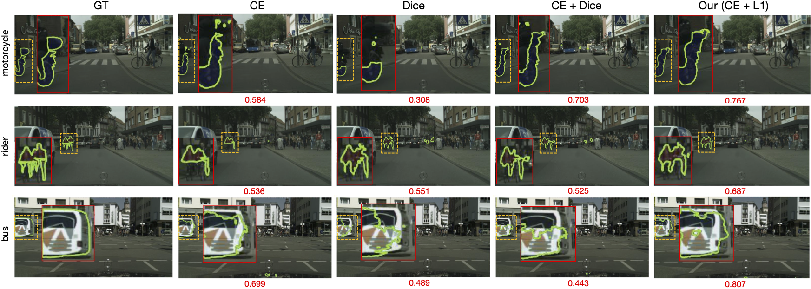

# The hidden label-marginal biases of segmentation losses

Code for the paper : The hidden label-marginal biases of segmentation losses. 

[[arxiv](https://arxiv.org/abs/2104.08717)] 



## Table of Content <!-- omit in table-of-content -->
 - [Prerequisites](#prerequisites)
 - [Prepare dataset](#prepare-dataset)
 - [Quick start](#quick-start)
 - [Future work](#future-work)
 - [License & Citatoin](#license)


## Prerequisites

1. Install [pytorch](https://pytorch.org/) and opencv tailored for your environment:
    ```
    torch==1.7.1
    torchvision==0.8.2
    opencv-python==4.5.1.48
    ```

2. Other depencencies
    ```
    pip install -r requirements.txt
    ```

3. Install the library
    ```
    pip install -e .
    ```

## Prepare dataset

- Retinal Lesions :
  
    This dataset is freely available but you need to submit a request based on their [repo](https://github.com/WeiQijie/retinal-lesions).
    We provide the experimental data split files [[link](https://drive.google.com/file/d/1nehNgvwN4eCscHhNPZEJHKDnoG-Q868r/view?usp=sharing)] .

    Here is the data structure to reproduce :
    ```
    ── data
    │   └── retinal-lesions-v20191227
    │       ├── classes.txt
    │       ├── images_896x896
    │       ├── lesion_segs_896x896
    │       ├── test.txt
    │       ├── train.txt
    │       └── val.txt
    ```

- Cityscapes :

    To download the dataset, please refer to the [official site](https://www.cityscapes-dataset.com/).

    Here is the recommended data structure :
    ```
    ├── Data
    │   ├── cityscapes
    │       ├── gtFine
    │       ├── leftImg8bit
    │       ├── license.txt
    │       └── README
    ```
    By convention, `**labelTrainIds.png` are used for cityscapes training and validation.
    We use the [scripts](https://github.com/open-mmlab/mmsegmentation/blob/master/tools/convert_datasets/cityscapes.py) in [mmsegmentation](https://github.com/open-mmlab/mmsegmentation) to generate `**labelTrainIds.png`.


## Quick start

### Testing with trained model

We provide two best models we currently trained on Retinal Lesions and Cityscapes for quick testing.

- Retinal Lesions: [model](https://drive.google.com/file/d/1c9CsFf8AlPKsDGHcjvvSNTN-4Zh2MX2w/view?usp=sharing)
  
    ```
    python tools/test_net.py --config-file ./configs/retinal-lesions/unet_bce-l1_896x896.yaml \\
        TEST.CHECKPOINT_PATH ./trained/retinal-lesions_r50unet_896x896_bce-l1.pth (OR_YOUR_LOCAL_PATH)
    ```

- Cityscapes : [model](https://drive.google.com/file/d/1ZP5d9a6KdZqW4oDH1EqSYLe1YvHhBuyy/view?usp=sharing)

    ```
    python tools/test_net.py --config-file ./configs/cityscapes/r50fpn_512x1024_ce_l1.yaml \\
        TEST.CHECKPOINT_PATH ./trained/cityscapes_r50fpn_512x1024_ce-l1.pth TEST.SPLIT val
    ```

### Configuration system

We use [YACS](https://github.com/rbgirshick/yacs) to define and manage all the configurations. In a nutshell, you typically create a YAML configuration file for each experiment.

All configurable options are defined in [`defaults.py`](seglossbias/config/defaults.py) with default values. Note that each YAML configuration file only overrides the options that are chaning in that experiment. You can also overriede options from the command line using a list of fully-qualified key, value pairs.


### Training

The configurations may seem confusing at first. You can play quickly with the provided configuration files.

- Retinal Lesions

```
python tools/train_net.py --config-file ./configs/retinal-lesions/unet_bce-l1_896x896.yaml
```

- Cityscapes

```
python tools/train_net.py --config-file ./configs/cityscapes/r50fpn_512x1024_ce_l1.yaml
```

Please refer to [Instructions](docs/INSTRUCTIONS.md) for more information about the configurable options and other baseline models.

## Future work
- [ ] Provide support for more medical image datasets, e.g., [WMH](https://wmh.isi.uu.nl/).
- [ ] Some visulization tools.
- [ ] Quick compatability with popular segmentation tools, like [nnUNet](https://github.com/MIC-DKFZ/nnUNet).

## License
This work is licensed under MIT License. See [LICENSE](LICENSE) for details.

If you find this paper/code useful for your research, please consider citing :

@misc{liu2021hidden,
      title={The hidden label-marginal biases of segmentation losses}, 
      author={Bingyuan Liu and Jose Dolz and Adrian Galdran and Riadh Kobbi and Ismail Ben Ayed},
      year={2021},
      eprint={2104.08717},
      archivePrefix={arXiv},
      primaryClass={cs.CV}
}

